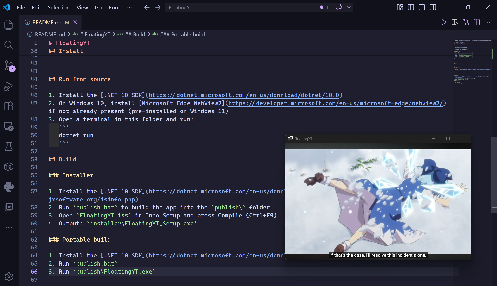

# FloatingYT

A lightweight Windows app that plays online videos in a floating window that stays on top of all other apps. Ideal for multitasking users.🐝



_Yes, I watch YouTube while working ᗜˬᗜ_

---

## Features

- Always-on-top resizable floating window
- Video fills the entire window automatically
- Auto-skips YouTube ads
- Auto-hide back button and volume control
- Supports YouTube, Bilibili, and Twitch

### Supported URLs

| Site     | URL                                         |
| -------- | ------------------------------------------- |
| YouTube  | `https://www.youtube.com/watch?v=...`       |
| YouTube  | `https://youtu.be/...`                      |
| YouTube  | `https://www.youtube.com/playlist?list=...` |
| Bilibili | `https://www.bilibili.com/video/BV...`      |
| Twitch   | `https://www.twitch.tv/channelname`         |
| Twitch   | `https://www.twitch.tv/videos/...`          |

---

## Requirements

- Windows 10 or 11

---

## Install

Download `FloatingYT_Setup.exe` from the [Releases](../../releases) page and run it.

---

## Run from source

1. Install the [.NET 10 SDK](https://dotnet.microsoft.com/en-us/download/dotnet/10.0)
2. On Windows 10, install [Microsoft Edge WebView2](https://developer.microsoft.com/en-us/microsoft-edge/webview2/) if not already present (pre-installed on Windows 11)
3. Open a terminal in this folder and run:
   ```
   dotnet run
   ```

## Build

### Installer

1. Install the [.NET 10 SDK](https://dotnet.microsoft.com/en-us/download/dotnet/10.0) and [Inno Setup](https://jrsoftware.org/isinfo.php)
2. Run `publish.bat` to build the app into the `publish\` folder
3. Open `FloatingYT.iss` in Inno Setup and press Compile (Ctrl+F9)
4. Output: `installer\FloatingYT_Setup.exe`

### Portable build

1. Install the [.NET 10 SDK](https://dotnet.microsoft.com/en-us/download/dotnet/10.0)
2. Run `publish.bat`
3. Run `publish\FloatingYT.exe`
